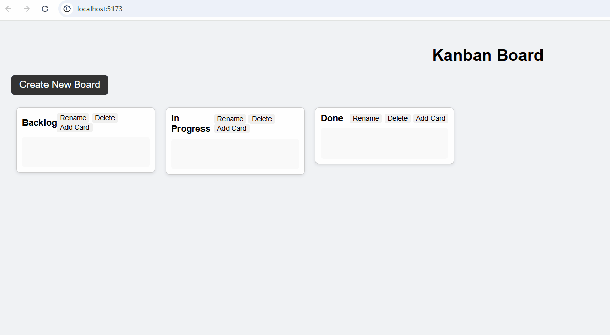

# Kanban Board



## Overview
This is a lightweight, frontend-only Kanban Board application built with **JavaScript** and **Vite**. The app allows users to create multiple boards and cards, drag and drop cards across boards using **SortableJS**, rename or delete boards, and manage card information with input validation via **Zod**. All data is persisted in the browser using **localStorage**, so no backend is required.

This project demonstrates core CRUD operations for boards and cards, real-time drag-and-drop functionality, input validation, and basic automated testing with **Vitest**.

## Features
- **Boards**
  - Create, rename, and delete boards.
- **Cards**
  - Add new cards to boards.
  - Delete cards from boards.
  - Drag and drop cards between boards with smooth animations.
- **Data Persistence**
  - All boards and cards are saved in **localStorage**, so your data is preserved across browser sessions.
- **Validation**
  - Input validation using **Zod** ensures titles and descriptions meet character limits and severity levels are correct.
- **Unique IDs**
  - Each board and card receives a unique ID via **UUID**.
- **Testing**
  - Basic automated tests using **Vitest** ensure card creation and deletion work correctly.

## Libraries Used
- [**SortableJS**](https://sortablejs.github.io/Sortable/) – Drag-and-drop support.
- [**UUID**](https://www.npmjs.com/package/uuid) – Generate unique identifiers.
- [**Zod**](https://zod.dev/) – Input validation for cards.
- [**Vitest**](https://vitest.dev/) – JavaScript testing framework.
- [**jsdom**](https://github.com/jsdom/jsdom) – Simulated browser environment for testing.

## Installation and Setup
Follow these steps to get the Kanban Board running locally:

```bash
# 1. Clone the repository
git clone https://github.com/harbinsela/kanban-board.git
cd kanban-board

# 2. Install dependencies
npm install
# Installs all required libraries and development tools listed in package.json

# 3. Start the development server
npm run dev
# Opens a local server (usually http://localhost:5173) to interact with your Kanban Board in real-time
# Any changes you make to the code will reload automatically

# 4. Build the project for production
npm run build
# Generates a production-ready version of the app in the /dist folder

# 5. Preview the production build locally
npm run preview
# Allows you to test the production build in a local browser environment

# 6. Run automated tests
npm run test
# Executes all Vitest tests located in /src/tests
# Validates core functionality such as creating and deleting cards
# The terminal will display ✅ Passed or ❌ Failed for each test

# 7. Watch tests automatically
npx vitest --watch
# Automatically reruns tests whenever a file changes
